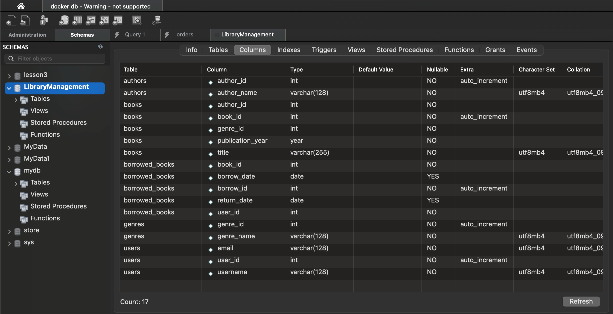
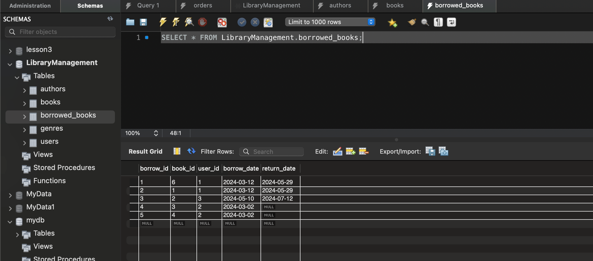
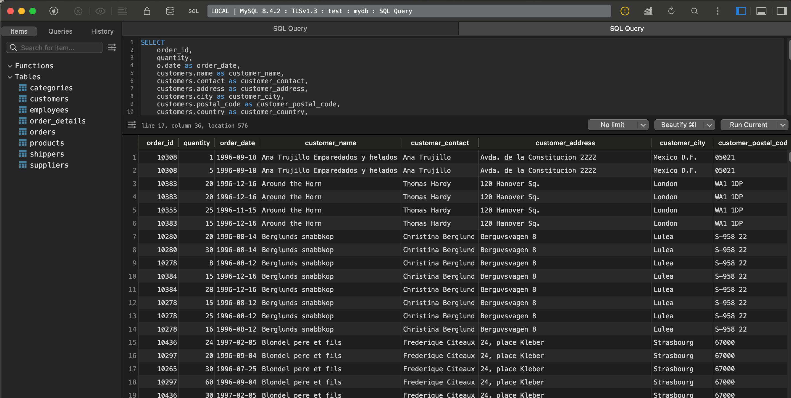
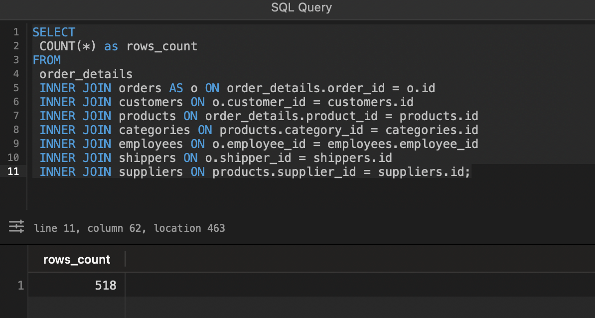
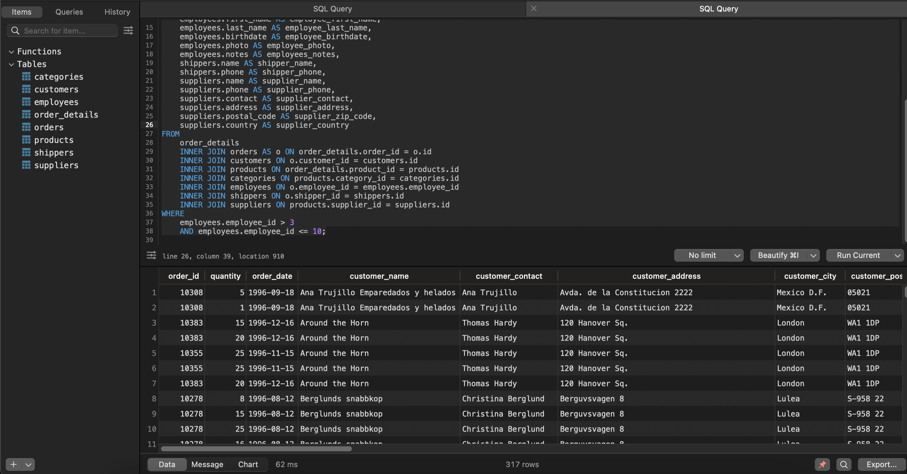
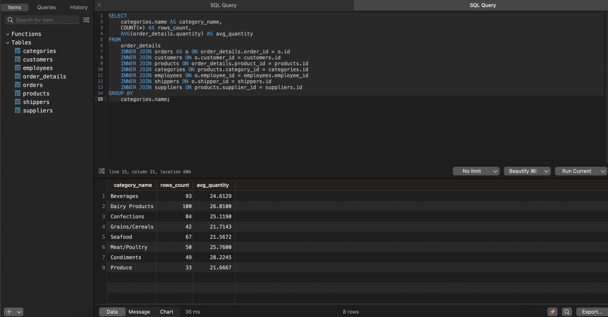
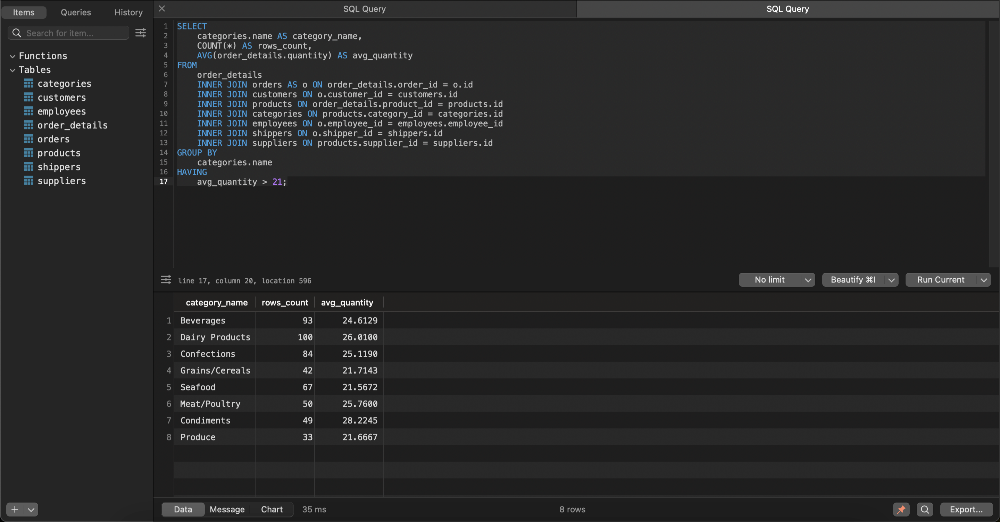
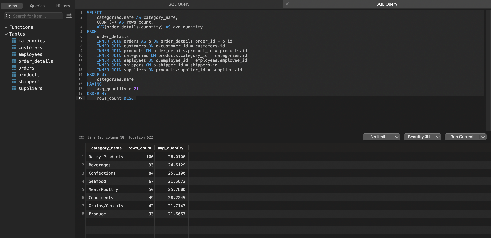
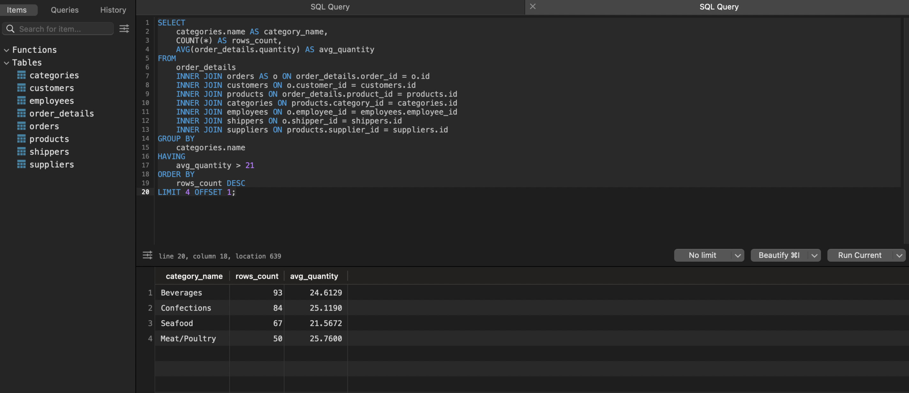

# goit-rdb-hw-04

## Завдання 1

Створіть базу даних для керування бібліотекою книг згідно зі структурою, наведеною нижче. Використовуйте DDL-команди для створення необхідних таблиць та їх зв'язків.

### Відповідь 1

```sql
CREATE DATABASE LibraryManagement;
USE LibraryManagement;

CREATE TABLE authors (
    author_id INT PRIMARY KEY AUTO_INCREMENT,
    author_name VARCHAR(128) NOT NULL
);

CREATE TABLE genres (
    genre_id INT PRIMARY KEY AUTO_INCREMENT,
    genre_name VARCHAR(128) NOT NULL
);

CREATE TABLE books (
    book_id INT PRIMARY KEY AUTO_INCREMENT,
    title VARCHAR(255) NOT NULL,
    publication_year YEAR NOT NULL,
    author_id INT NOT NULL,
    genre_id INT NOT NULL, 
    FOREIGN KEY (author_id) REFERENCES authors(author_id),
    FOREIGN KEY (genre_id) REFERENCES genres(genre_id)
);

CREATE TABLE users (
    user_id INT PRIMARY KEY AUTO_INCREMENT,
    username VARCHAR(128) NOT NULL,
    email VARCHAR(128) NOT NULL
);
CREATE TABLE borrowed_books (
    borrow_id INT PRIMARY KEY AUTO_INCREMENT,
    book_id INT NOT NULL,
    user_id INT NOT NULL,
    borrow_date DATE,
    return_date DATE,
    FOREIGN KEY (book_id) REFERENCES books(book_id),
    FOREIGN KEY (user_id) REFERENCES users(user_id)
);
```

---


## Завдання 2

Заповніть таблиці простими видуманими тестовими даними. Достатньо одного-двох рядків у кожну таблицю.

### Відповідь 2

```sql
INSERT INTO authors (author_name)
    values 
    ("Isaac Asimov"), 
    ("Arthur C. Clarke"), 
    ("Philip K. Dick"), 
    ("Ursula K. Le Guin"), 
    ("William Gibson"), 
    ("H.G. Wells"), 
    ("Frank Herbert"), 
    ("Robert A. Heinlein"), 
    ("Neal Stephenson");

INSERT INTO genres (genre_name)
    values
    ("Sci-Fi"),
    ("Cyberpunk"),
    ("Fantasy");

INSERT INTO books (title, publication_year, author_id, genre_id)    
    values
    ("The Ones Who Walk Away from Omelas", 1972, 4, 3),
    ("Neuromancer", 1984, 5, 2),
    ("Starship Troopers", 1959, 8, 1),
    ("To Sail Beyond the Sunset", 1987, 8, 1),
    ("Foundation", 1951, 1, 1), 
    ("The End of Eternity", 1955, 1, 1);

INSERT INTO users (username, email)
    values
    ("Bob", "bob@example.com"),
    ("Sam", "theverylongemailaddress@example.com"),
    ("Bill", "bill@example.com");

INSERT INTO borrowed_books (book_id, user_id, borrow_date, return_date) 
    values
    (6, 1, "2024-03-12", "2024-05-29"),
    (1, 1, "2024-03-12", "2024-05-29"),
    (2, 3, "2024-05-10", "2024-07-12");

INSERT INTO borrowed_books (book_id, user_id, borrow_date) 
    values
    (3, 2, "2024-03-02"),
    (4, 2, "2024-03-02");  
```

---


## Завдання 3

Перейдіть до бази даних, з якою працювали у темі 3. Напишіть запит за допомогою операторів FROM та INNER JOIN, що об’єднує всі таблиці даних, які ми завантажили з файлів: order_details, orders, customers, products, categories, employees, shippers, suppliers. Для цього ви маєте знайти спільні ключі.

Перевірте правильність виконання запиту.

### Відповідь 3

```sql
SELECT
 order_id,
 quantity, 
 o.date as order_date,
 customers.name as customer_name, 
 customers.contact as customer_contact,
 customers.address as customer_address, 
 customers.city as customer_city,
 customers.postal_code as customer_postal_code,
 customers.country as customer_country,
 products.name as product_name,
 categories.name as category_name,
 categories.description as category_description,
 employees.first_name as employee_first_name,
 employees.last_name as employee_last_name,
 employees.birthdate as employee_birthdate,
 employees.photo as employee_photo,
 employees.notes as employees_notes,
 shippers.name as shipper_name,
 shippers.phone as shipper_phone,
 suppliers.name as supplier_name,
 suppliers.phone as supplier_phone,
 suppliers.contact as supplier_contact,
 suppliers.address as supplier_address,
 suppliers.postal_code as supplier_zip_code,
 suppliers.country as supplier_country 
FROM
 order_details
 INNER JOIN orders AS o ON order_details.order_id = o.id
 INNER JOIN customers ON o.customer_id = customers.id
 INNER JOIN products ON order_details.product_id = products.id
 INNER JOIN categories ON products.category_id = categories.id
 INNER JOIN employees ON o.employee_id = employees.employee_id
 INNER JOIN shippers ON o.shipper_id = shippers.id
 INNER JOIN suppliers ON products.supplier_id = suppliers.id;
```

---


Приклад даних з результату запиту (з `LIMIT 10`) доступні у файлі [3.csv](3.csv).

## Завдання 4

1. Визначте, скільки рядків ви отримали (за допомогою оператора COUNT).
2. Змініть декілька операторів INNER на LEFT чи RIGHT. Визначте, що відбувається з кількістю рядків. Чому? Напишіть відповідь у текстовому файлі.
3. Оберіть тільки ті рядки, де employee_id > 3 та ≤ 10.
4. Згрупуйте за іменем категорії, порахуйте кількість рядків у групі, середню кількість товару (кількість товару знаходиться в order_details.quantity)
5. Відфільтруйте рядки, де середня кількість товару більша за 21.
6. Відсортуйте рядки за спаданням кількості рядків.
7. Виведіть на екран (оберіть) чотири рядки з пропущеним першим рядком.

### Відповідь 4

#### 1

```sql
SELECT
 COUNT(*) as rows_count
FROM
 order_details
 INNER JOIN orders AS o ON order_details.order_id = o.id
 INNER JOIN customers ON o.customer_id = customers.id
 INNER JOIN products ON order_details.product_id = products.id
 INNER JOIN categories ON products.category_id = categories.id
 INNER JOIN employees ON o.employee_id = employees.employee_id
 INNER JOIN shippers ON o.shipper_id = shippers.id
 INNER JOIN suppliers ON products.supplier_id = suppliers.id;
```

```sh
+------------+
| rows_count |
+------------+
|        518 |
+------------+
```

---


#### 2

TBD

#### 3

```sql
SELECT
 order_id,
 quantity,
 o.date AS order_date,
 customers.name AS customer_name,
 customers.contact AS customer_contact,
 customers.address AS customer_address,
 customers.city AS customer_city,
 customers.postal_code AS customer_postal_code,
 customers.country AS customer_country,
 products.name AS product_name,
 categories.name AS category_name,
 categories.description AS category_description,
 employees.first_name AS employee_first_name,
 employees.last_name AS employee_last_name,
 employees.birthdate AS employee_birthdate,
 employees.photo AS employee_photo,
 employees.notes AS employees_notes,
 shippers.name AS shipper_name,
 shippers.phone AS shipper_phone,
 suppliers.name AS supplier_name,
 suppliers.phone AS supplier_phone,
 suppliers.contact AS supplier_contact,
 suppliers.address AS supplier_address,
 suppliers.postal_code AS supplier_zip_code,
 suppliers.country AS supplier_country
FROM
 order_details
 INNER JOIN orders AS o ON order_details.order_id = o.id
 INNER JOIN customers ON o.customer_id = customers.id
 INNER JOIN products ON order_details.product_id = products.id
 INNER JOIN categories ON products.category_id = categories.id
 INNER JOIN employees ON o.employee_id = employees.employee_id
 INNER JOIN shippers ON o.shipper_id = shippers.id
 INNER JOIN suppliers ON products.supplier_id = suppliers.id
WHERE
 employees.employee_id > 3
 AND employees.employee_id <= 10;
```

---


#### 4

```sql
SELECT
    categories.name AS category_name,
    COUNT(*) AS rows_count,
    AVG(order_details.quantity) AS avg_quantity
FROM
    order_details
    INNER JOIN orders AS o ON order_details.order_id = o.id
    INNER JOIN customers ON o.customer_id = customers.id
    INNER JOIN products ON order_details.product_id = products.id
    INNER JOIN categories ON products.category_id = categories.id
    INNER JOIN employees ON o.employee_id = employees.employee_id
    INNER JOIN shippers ON o.shipper_id = shippers.id
    INNER JOIN suppliers ON products.supplier_id = suppliers.id
GROUP BY
    categories.name;
```

---


#### 5

```sql
SELECT
 categories.name AS category_name,
 COUNT(*) AS rows_count,
 AVG(order_details.quantity) AS avg_quantity
FROM
 order_details
 INNER JOIN orders AS o ON order_details.order_id = o.id
 INNER JOIN customers ON o.customer_id = customers.id
 INNER JOIN products ON order_details.product_id = products.id
 INNER JOIN categories ON products.category_id = categories.id
 INNER JOIN employees ON o.employee_id = employees.employee_id
 INNER JOIN shippers ON o.shipper_id = shippers.id
 INNER JOIN suppliers ON products.supplier_id = suppliers.id
GROUP BY
 categories.name
HAVING
 avg_quantity > 21;
```

---


#### 6

```sql
SELECT
 categories.name AS category_name,
 COUNT(*) AS rows_count,
 AVG(order_details.quantity) AS avg_quantity
FROM
 order_details
 INNER JOIN orders AS o ON order_details.order_id = o.id
 INNER JOIN customers ON o.customer_id = customers.id
 INNER JOIN products ON order_details.product_id = products.id
 INNER JOIN categories ON products.category_id = categories.id
 INNER JOIN employees ON o.employee_id = employees.employee_id
 INNER JOIN shippers ON o.shipper_id = shippers.id
 INNER JOIN suppliers ON products.supplier_id = suppliers.id
GROUP BY
 categories.name
HAVING
 avg_quantity > 21
ORDER BY
 rows_count DESC;
```

---


#### 7

```sql
SELECT
 categories.name AS category_name,
 COUNT(*) AS rows_count,
 AVG(order_details.quantity) AS avg_quantity
FROM
 order_details
 INNER JOIN orders AS o ON order_details.order_id = o.id
 INNER JOIN customers ON o.customer_id = customers.id
 INNER JOIN products ON order_details.product_id = products.id
 INNER JOIN categories ON products.category_id = categories.id
 INNER JOIN employees ON o.employee_id = employees.employee_id
 INNER JOIN shippers ON o.shipper_id = shippers.id
 INNER JOIN suppliers ON products.supplier_id = suppliers.id
GROUP BY
 categories.name
HAVING
 avg_quantity > 21
ORDER BY
 rows_count DESC
LIMIT 4 OFFSET 1;
```

---

